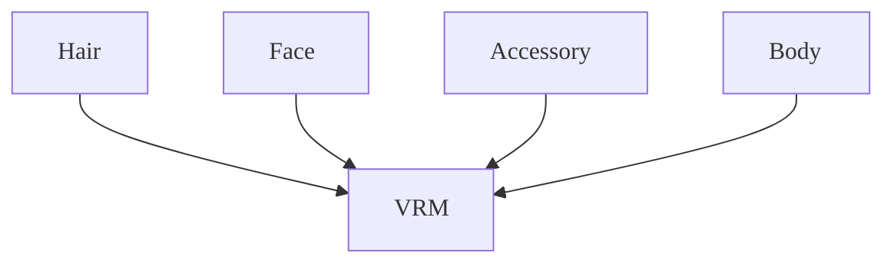

### Assemble

NFT content has metadata which contains the URL link to the avatar model file location. Each 3D model is composed of a few blender files which include body, hair, and face meshes. Realbits uses VRM model for avatar, and VRM has body, hair, and face meshes basically. And there are armatures for humanoid bones and hair or clothes bones. Each blender file of a body, hair, and face must be assembled using a program script linking the armature of the body and hair or body and clothes. In addition, if clothes are separate from body mesh, the program must join the two of them together as well.

### Process

