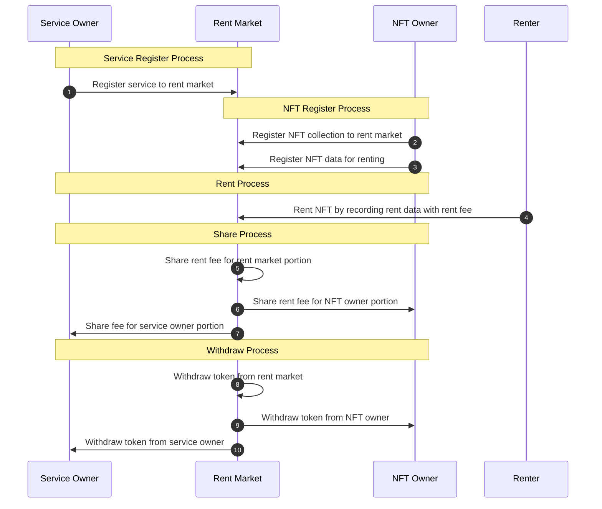

### Total Process

In a NFT rent market ecosystem, there are three parties. They are content, service, and market owner. **An NFT content owner registers their collection with a rent market**. This is done with their collection contract address and collection information URL, which the rent market uses to display a title and image for the collection. As the user rents NFT content through the service, the owner's address is recorded, to whom the rent fee will be transferred. Additionally, **the service owner is required to register the service owner's address and information URL**. **Market owner is running a NFT rent market.** A portion of the rent fee will be transferred to the owner's address. And later, **each party can withdraw their rent fee token from a rent market**.

### How to register service

### How to register collection

### How to register NFT
