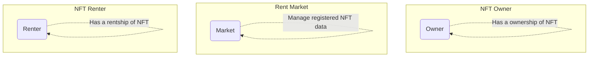
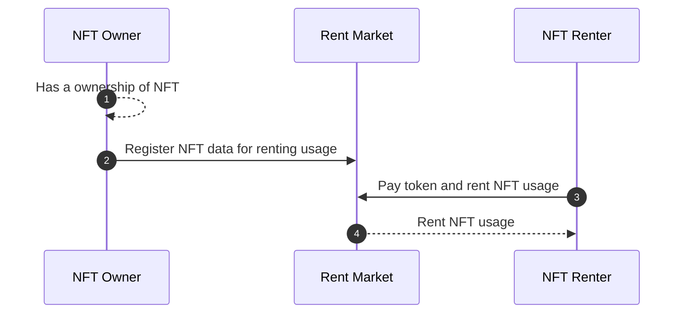

### Background

**Rent Market** is a smart contract that enables users to register NFT and **rent NFT**.

### Problem

**NFT** is innately a limited resource item in the digital world. Due to this, **its usage has been restricted to the owner**. However, more people use a specific NFT, so the NFT has more utility.

### Solution

There are a few services that rent NFT to solve an NFT use case. But it is limited to the ERC-721 specification. As an example, in EIP-4907, if NFT is transferred, its renter will be removed, regardless of the renter's wishes. So, **Realbits divides ownership of NFT and rentship of NFT**. In other words, even if NFT has been transferred to another owner, its rent usage remains during its lease term.

### How to

When a NFT owner **registers NFT to a rent market**, NFT registration data is also recorded, such as rent fee or rent duration. Likewise, when someone **rents NFT from a rent market**, rent-metadata will be recorded, such as the rent fee and who is the owner and who is the renter of NFT. Upon termination of the rent, **the rent fee will be shared among the NFT owner, the service owner, and the market owner**. Distribution would be handled by calling the settlement function in a smart contract, which can be run by anyone with a gas fee. All rent-related data is stored in smart contracts that anyone can access. If you have a balance in the rental market, you can withdraw your fee.

### Think more

The rental process of NFT requires many options for running. Early on, each rent payment was to be made through MATIC in a polygon network. However, some users may want to use other ERC-20 tokens. In a beta service operation, rent duration is also a constant term, but some users prefer a flexible lease term.

### Build more

There is currently an optional part that can be minimized. However, as the renting operation continues, more flexible and optional management processes will be implemented.
